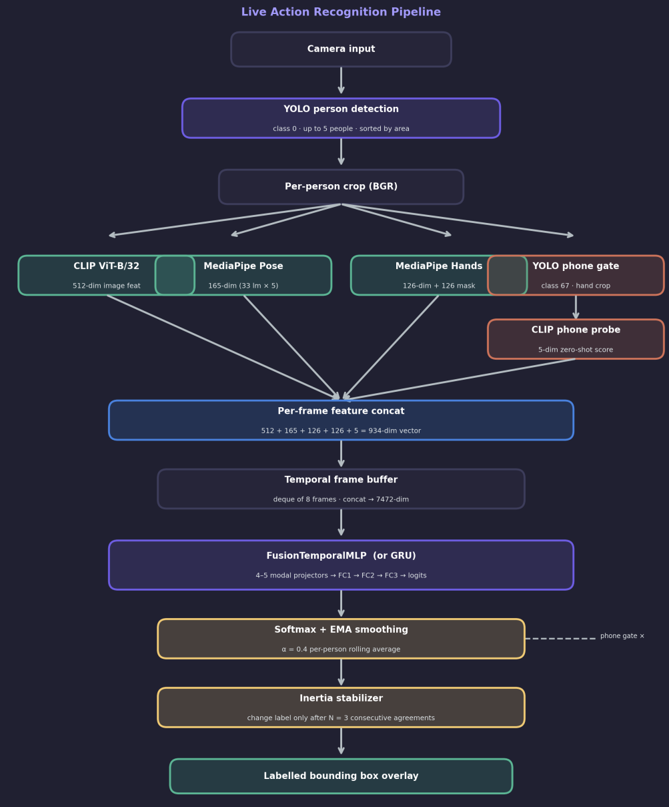
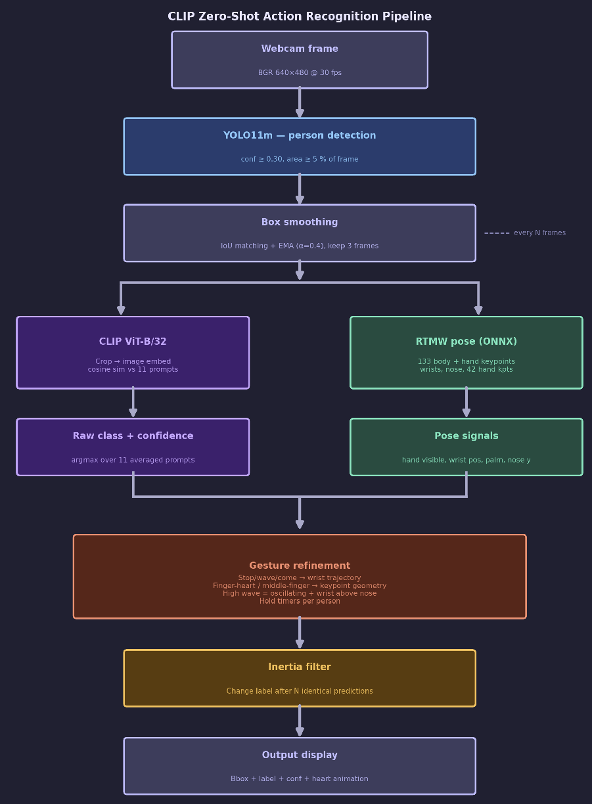

# VLM MLP Action Recognition

This repository contains two action-recognition pipelines that combine visual features with body and hand keypoints.

## Model 1: Custom-Trained Fusion Model

The first model uses custom training data collected from proprietary recordings. It combines:

- body skeleton keypoint detection
- hand tracking
- a visual encoder
- a temporal GRU classifier trained on multi-frame sequences

The model recognizes six actions:

- `come`
- `wave`
- `stop`
- `idle`
- `talk_phone`
- `play_phone`

### Architecture



### Demo Video

[Watch Model 1 demo](https://youtu.be/v9XFNTURlHk)

### Environment Setup

```bash
python3 -m venv vlm_mlp
source vlm_mlp/bin/activate
python -m pip install -U pip
export HUGGINGFACE_HUB_CACHE="$PWD/.cache/huggingface/hub"

pip install torch torchvision transformers open_clip_torch pillow opencv-python==4.11.0.86 ultralytics mediapipe onnxruntime
```

### Training

```bash
python3 train_mlp_clip_b_8frames_marker.py \
  --temporal-model gru --num-frames 8 --epochs 100 \
  --rnn-hidden 192 --hidden 256 \
  --out fusion_gru_8frames_marker.pt
```

### Live Inference

```bash
python3 live_camera_predict_multiperson_inertial_640_8frames_marker.py \
  --ckpt fusion_gru_8frames_marker.pt --camera 0 --yolo yolo11n.pt \
  --ema-alpha 0.4 --inertia 1
```

## Model 2: Zero-Shot Action Recognition

The second model avoids recorded training data by using a zero-shot approach. It combines:

- body skeleton keypoint detection
- hand tracking
- a visual encoder
- prompt-based zero-shot action matching

The model recognizes ten actions:

- `come`
- `wave`
- `high wave`
- `stop`
- `idle`
- `talk_phone`
- `play_phone`
- `take_picture`
- `love`
- `small_love`

### Architecture



### Demo Video

[Watch Model 2 demo](https://youtu.be/mvrTgWqcuwI)

### Run

```bash
python3 clip_zero_shot_7actions.py
```

## Notes

- Model 1 is the trained production-style pipeline and requires custom labeled data.
- Model 2 is the zero-shot pipeline and is useful when recorded training data is unavailable.
- Both pipelines rely on pose and hand landmarks to improve action discrimination beyond image-only features.